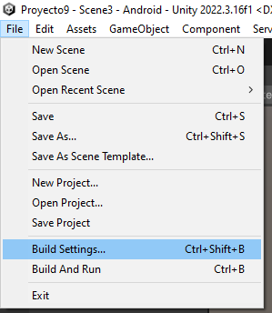
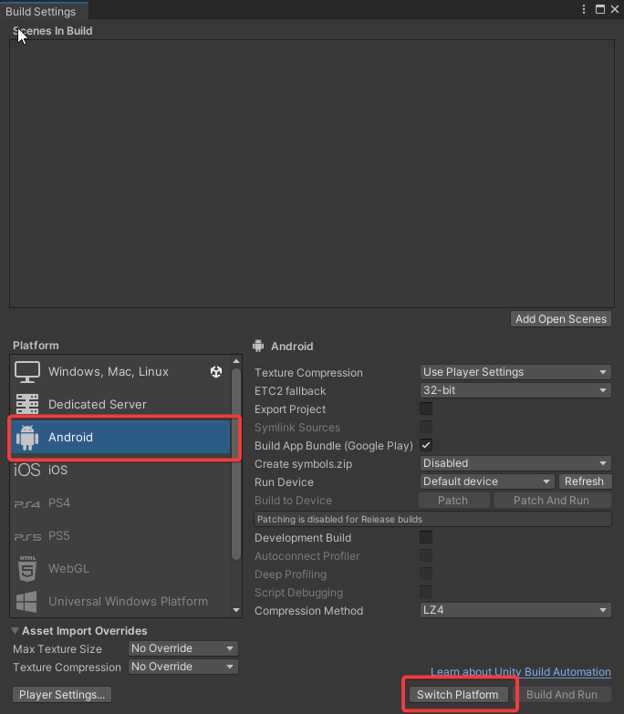
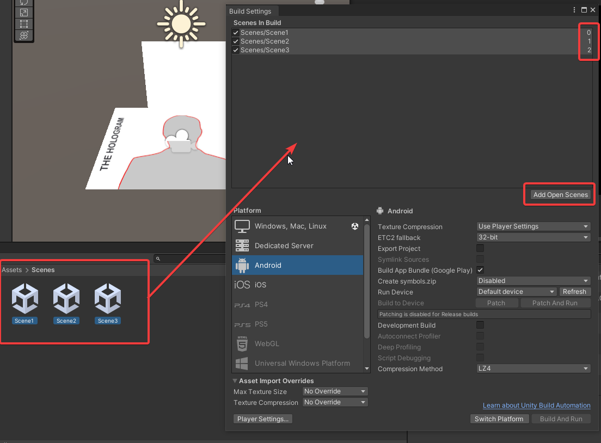

# Android

Unity puede crear aplicaciones de Android en los siguientes formatos de publicación:
- APK
- Paquete de aplicaciones de Android (AAB)

## Cómo generar el APK

1. Una vez finalizado el proyecto vamos a compilar, para ello pinchamos en **File > Build Settings** 

    
    
2. Comprobamos que se encuentre seleccionada el tipo de plataforma Android. Si no se encuentra pinchamos en Android y posteriormente **Switch Platform** 
    
    

3. Añadimos escenas. Para ello podemos ir añadiendo individualmente desde el botón **Add Open Scenes** o bien seleccionarlas y arrastar. Es importante mantener el orden de las escenas.

     

4. 

## Cómo generar el AAB