# Android

Unity puede crear aplicaciones de Android en los siguientes formatos de publicación:
- APK
- Paquete de aplicaciones de Android (AAB)

## Cómo generar el APK

1. Una vez finalizado el proyecto vamos a compilar, para ello pinchamos en **File > Build Settings** 

    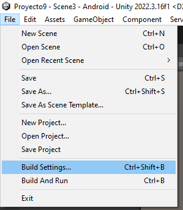
    
2. Comprobamos que se encuentre seleccionada el tipo de plataforma Android. Si no se encuentra pinchamos en Android y posteriormente **Switch Platform** 
    
    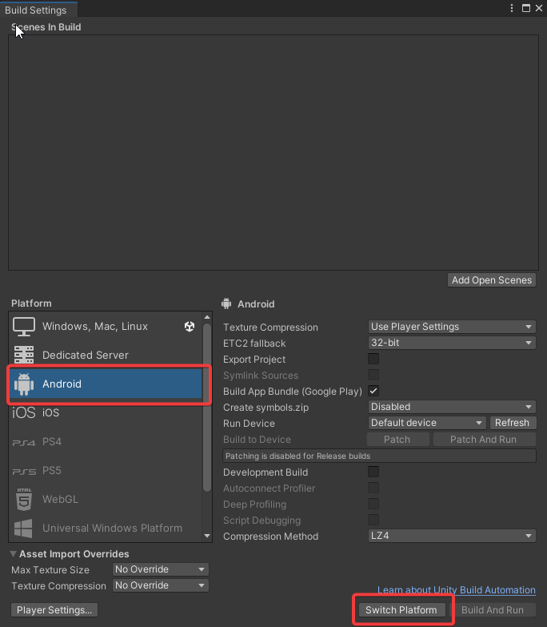

3. Añadimos escenas. Para ello podemos ir añadiendo individualmente desde el botón **Add Open Scenes** o bien seleccionarlas y arrastar. Es importante mantener el orden de las escenas.

     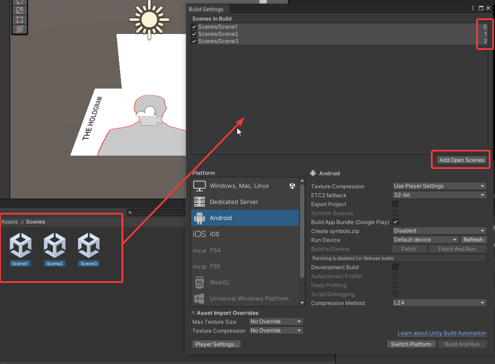

4. A continuación, en **Player Settings** podremos configurar los valores por defecto de muchos de los parámetros que son utilizados durante la generación del juego.

    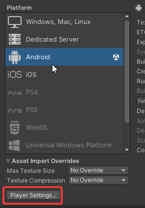

5. Se abre la siguiente ventana y en el apartado de **Player** podremos modificar el nombre de nuestra APP y el icono 

    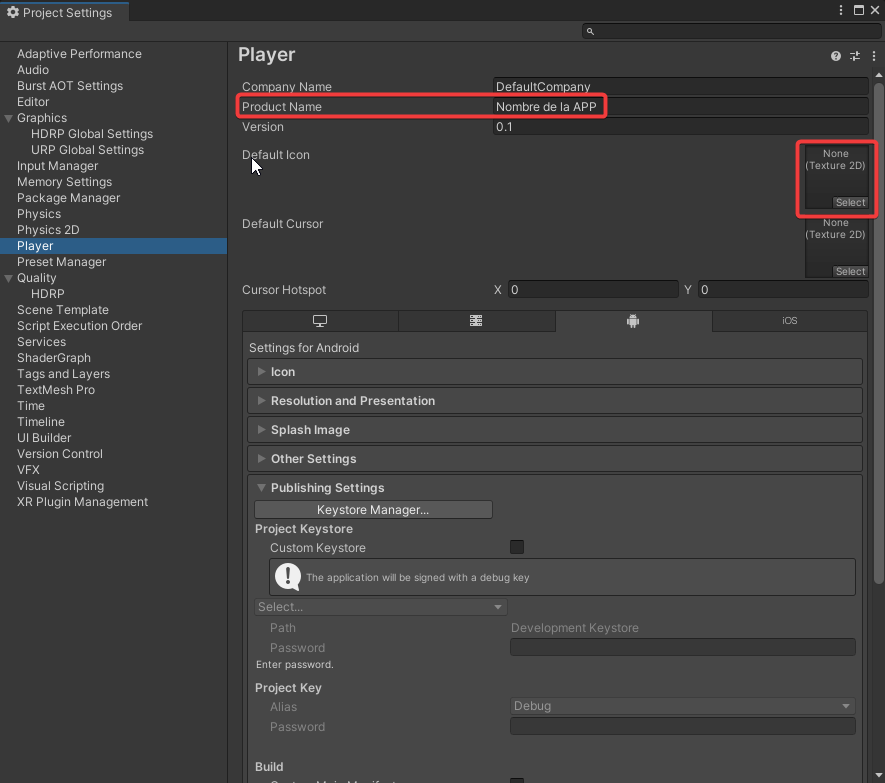

    - Dentro de **Player > Other Settings** tendremos que realizar la siguiente configuración
        - Desmarcamos check **Auto Graphics API** y eliminamos **Vulkan**
        - Aumentamos **Minimun API Level** -> API Level 29
        - **Scripting Backend** -> IL2CPP
        - **ARM64** -> Marcamos check y desmarcamos **ARMv7**    
            (*ARM64 ofrece una mayor capacidad de procesamiento de datos y dirección de memoria en comparación con ARMv7, lo que puede traducirse en un mejor rendimiento en ciertas aplicaciones, especialmente en dispositivos con una gran cantidad de RAM y procesadores de 64 bits.*)

        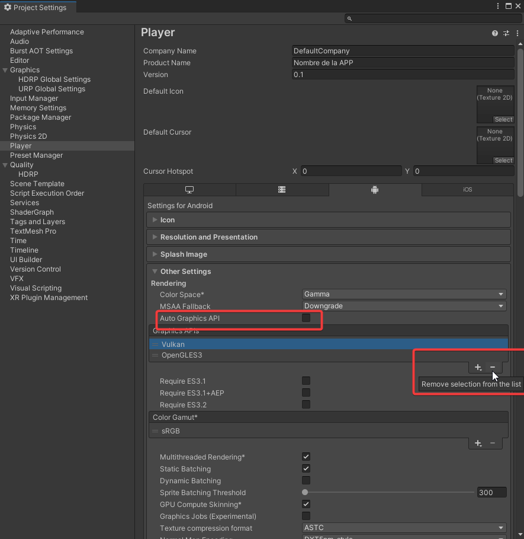

        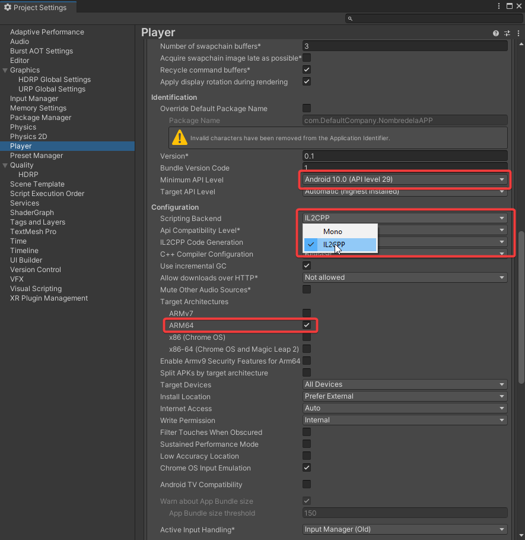

6. Pinchamos en **XR Plugin Management** -> **Install XR Plugin Management**

    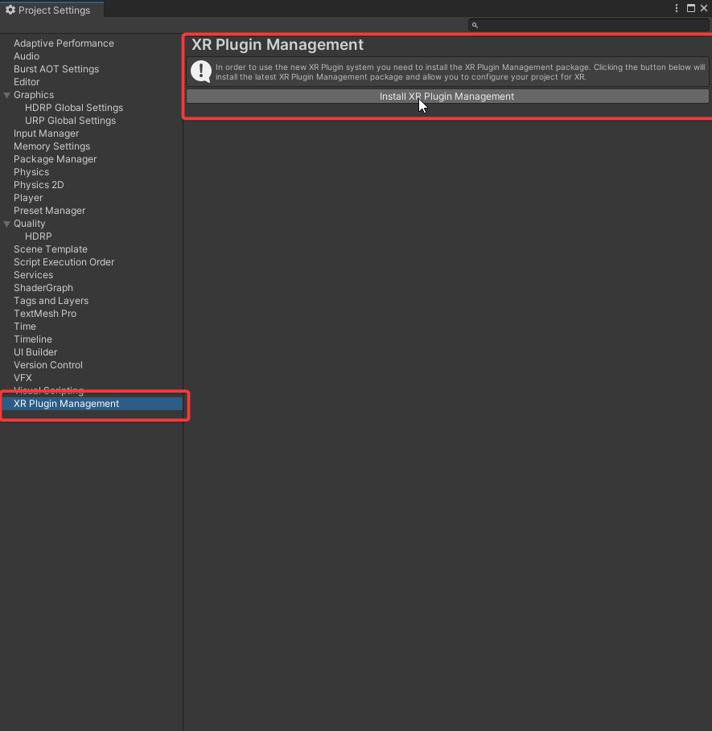

7. Una vez que se instala el Plugin, marcamos el check **Google ARCore**

    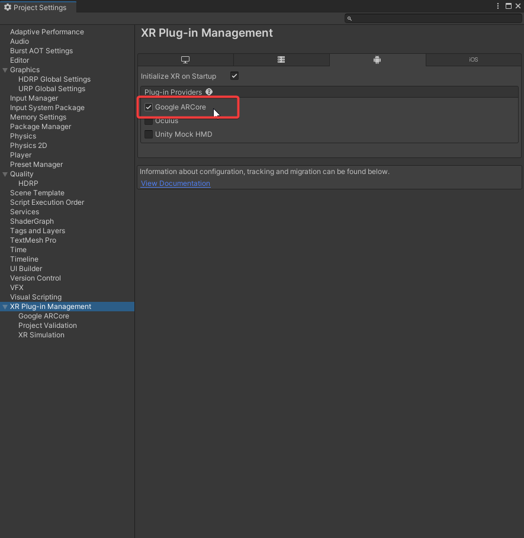

8. Finalmente clickamos en **Build** y seleccionamos la ruta para generar el APK

    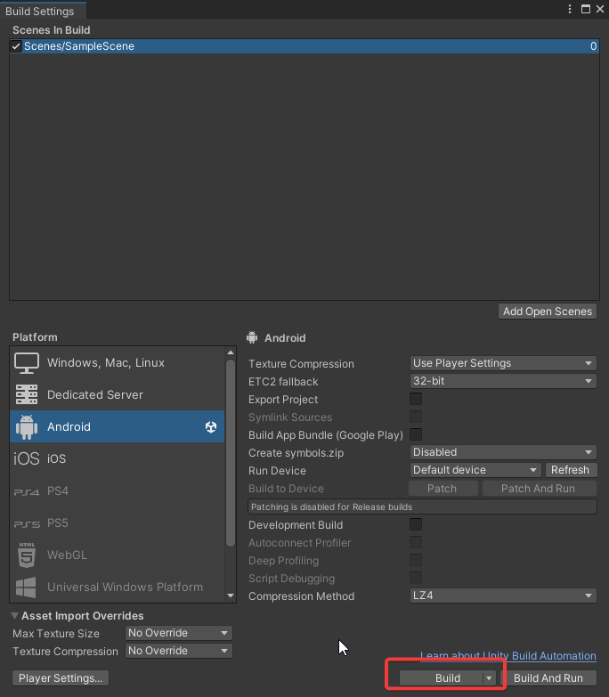

## Cómo generar el AAB

1. Para generar el archivo AAB debemos seguir los pasos anteriores pero marcando el check **Build App Bundle**

    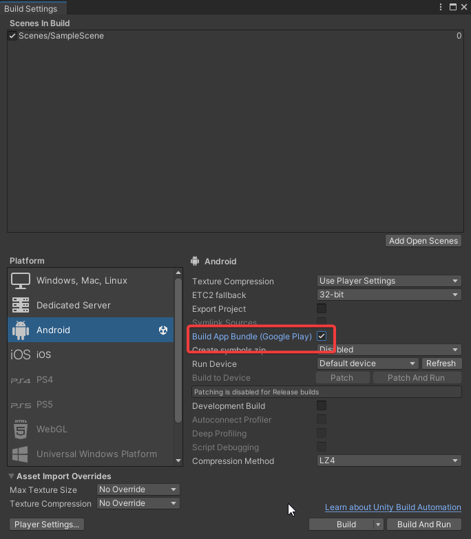