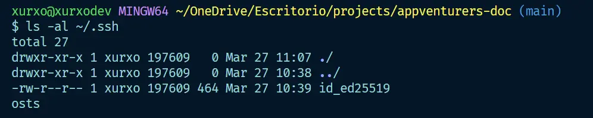
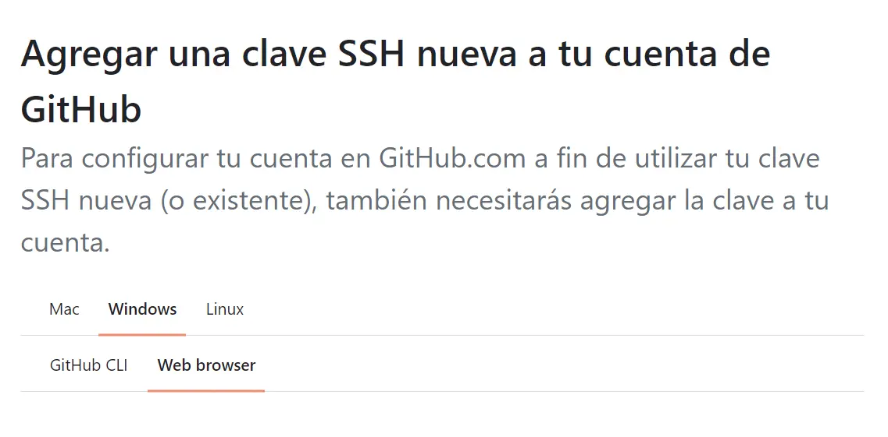

# Comandos Git [🔙](/)

:link: [Comandos más utilizados](https://training.github.com/downloads/es_ES/github-git-cheat-sheet/)

## Video tutorial

[](https://www.youtube.com/watch?v=niPExbK8lSw&t=2265s)

## Clonar

### Clonar ramas a una profundidad

A veces no hace falta clonar totalmente todo el histórico o commits de un repositorio puede con el tiempo ocupar bastante. Una opción es clonar hasta un commit o "profundidad" que desemos. Por ejemplo, clonamos un repositiorio hasta el último commit:

```sh
git clone --depth 1   https://github.com/webferrol/my-github-repo.git
```

## Branch

### Listar todas las ramas

```sh
git branch
```

### Cambiar de rama

```sh
git switch nombre_de_tu_rama
```

### Crear y cambiar a una nueva rama

```sh
git switch -c nombre_de_tu_rama
```

### Fusionar ramas

```sh
git merge nombre_de_tu_rama
```

>⚠️ Si hay conflictos entre las dos ramas, Git te pedirá que resuelvas esos conflictos antes de completar la fusión.

### Eliminar ramas

```sh
git branch -d nombre_de_tu_rama
```

Si lo que deseas es eliminar una **rama remota**:

```sh
git push origin --delete nombre_de_tu_rama
```

## Clonado mediante SSH

Toda la información la tienes en la [docmentanción de Github](https://docs.github.com/es/authentication/connecting-to-github-with-ssh/generating-a-new-ssh-key-and-adding-it-to-the-ssh-agent)

### [Generar una clave SSH en Github](https://docs.github.com/es/authentication/connecting-to-github-with-ssh/generating-a-new-ssh-key-and-adding-it-to-the-ssh-agent#generating-a-new-ssh-key)


### [Comprobar tus claves SSH existentes](https://docs.github.com/es/authentication/connecting-to-github-with-ssh/checking-for-existing-ssh-keys#checking-for-existing-ssh-keys)

```sh
ls -al ~/.ssh
```



### [Agregar una clave SSH nueva a tu cuenta de GitHub](https://docs.github.com/es/authentication/connecting-to-github-with-ssh/adding-a-new-ssh-key-to-your-github-account?platform=windows&tool=webui)

Fíjate que tengas seleccionado tu **sistema operativo** y el entorno de desarrollo con el que desees trabajar (Github CLI, Web browser)



A partir de aquí lea la documentación y siga las instrucciones.

## Contributing

Aunque no son conceptos propiamente de **Git** esta sección es para todos los que quieran contribuir en el proyecto.

Para contribuir en la documentación es necesario realizar una **solicitud de petición de cambios** (<abbr title="Pull Request">PR</abbr>).

Este es el mecanismo para todos aquellos usuarios que no son **colaboradores** del proyecto. 

Para ello el mecanismo adecuado es realizar un **fork** al proyecto y para cualquier cambio que realicen del mismo soliciar una **PR** a los miembros *colaborators*.

La forma de escribir las *solicitudes de cambio* vienen el fichero [CONTRIBUTING.md](/CONTRIBUTING.md)
