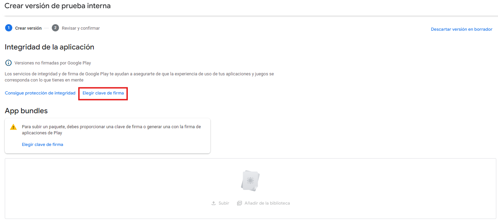
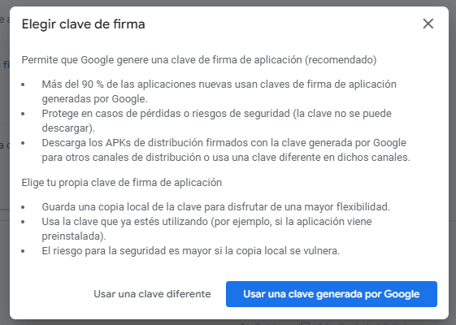

# Configuración

## Básica

1. Na pantalla de inicio clicamos en **crear aplicación**.
   

2. Cubrimos os datos solicitados da aplicación.

3. Seleccionamos os testers e dámoslle a xerar versión, o que crea automaticamente unha proba interna.
    

4. Unha vez creada a versión, clicamos en **elixir clave de firma**.
    

    E escollemos a opción de **usar clave xerada por Google**.
    

5. Realizados estos pasos volcamos a nosa aab no apartado de **App Bundles**. Agora xa temos creada a primeira versión interna da nosa aplicación que se pode ver no apartado **Pruebas Internas** no menú da esquerda.

## Actualización de versións de probas internas

1. Para actualizar a versión da nosa app, dentro do apartado da aplicación en Lanzamientos>Pruebas>Prueba interna, seleccionamos **Crear nueva versión**.
   

2. Subir a nova aab no apartado **App Bundles**.

3. Para habilitar a actualización aos testers, na ventana de Prueba interna, clicamos en **Gestionar la versión**.
    

4. A continuación, clicamos en **Herramientas de recuperación>Pedir a los usuarios que actualicen su versión**.
   

