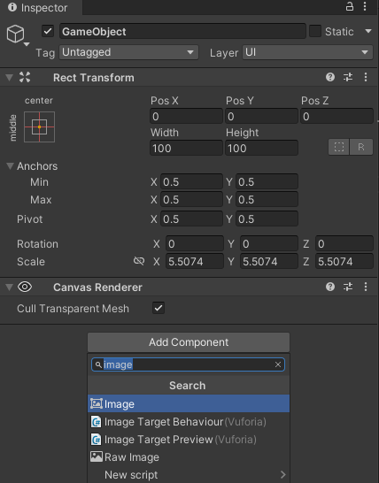
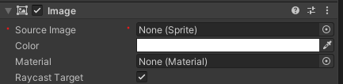
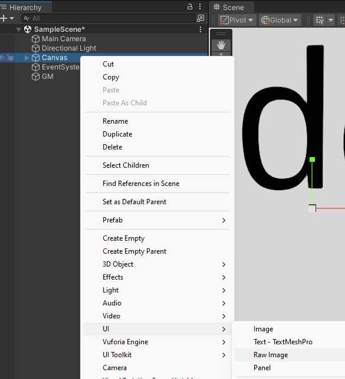
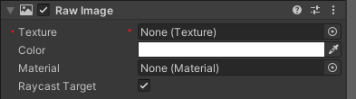

# Como incluir imaxes e vídeos en Unity

## Imaxes

1. Crear **carpeta Images** (nome recomendado porque desta maneira nos proxectos 2D convirte as imaxes a Sprites automaticamente) dentro da **carpeta Assets** e arrastrar as imaxes á carpeta.
2. - Se é un proxecto 2D
        1. Crear un **Game Object vacío** (Create Empty).

        2. No panel *Inspector* engadir o compoñente **Image** ao Game Object.

            

        3. Arrastrar a imaxe ao apartado **Source image**.

            

    - Se é un proxecto 3D: 
        1. Engadir o compoñente de UI **Raw image** clicando co botón dereito sobre o Game Object dende o panel de *Hierarchy*.

            

        2. No panel *Inspector* da Raw image arrastrar a imaxe que se quere incluir no apartado de **Texture**.

            

## Videos
