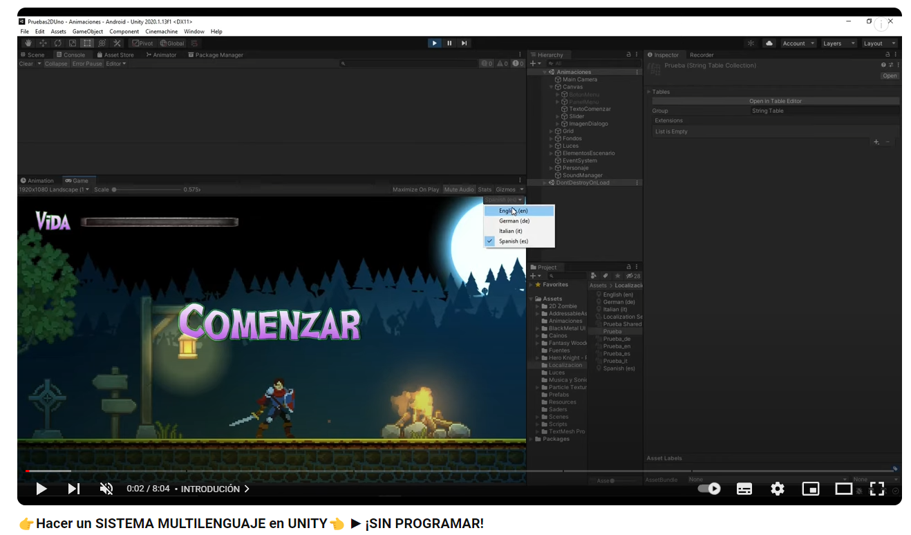
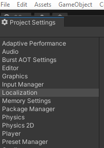
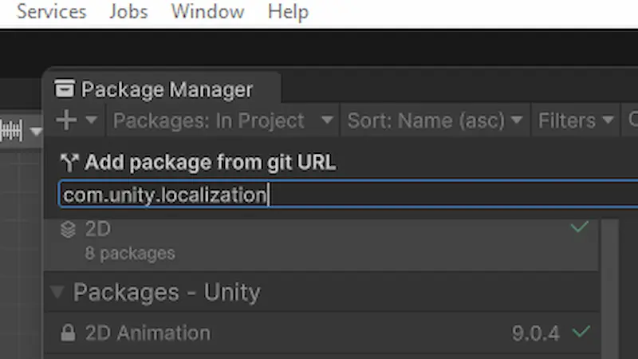
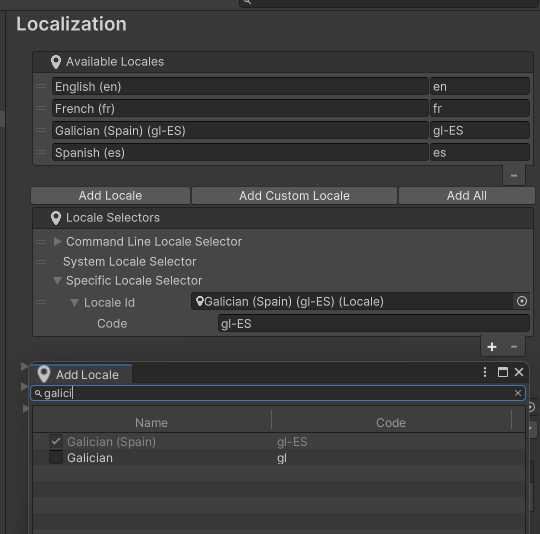
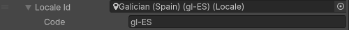
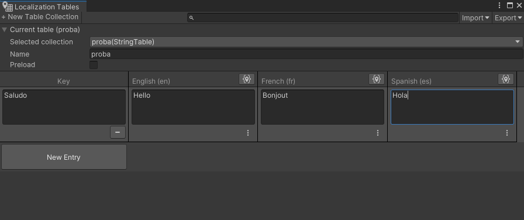
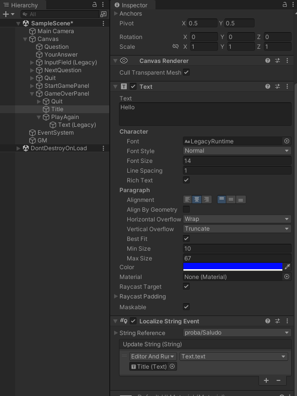
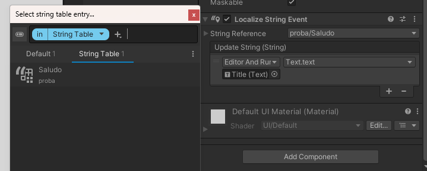

# Implentación do sistema de idiomas en Unity

## Fonte

## Pasos

1. Hai que instalar o paquete de localizacións en Unity. No menú superior pinchamos en Edit e imos a **Project Settings**. Na ventana que nos abre debería aparecernos o paquete.
    
    

    - Se non é o caso, debemos facer o seguinte:

    Pinchamos en Window (menú superior) e imos a **Package Manager**. Descargaremos o paquete dende unha URL (pinchamos arriba á esquerda no símbolo '+' e na opción 'add package from git URL') copiaremos isto: **com.unity.localization** e xa se nos instalará. No caso de que non apareza ou non actualice pecharemos e volveremos a abrir o programa.

    

2. Ao volver a abrir o Project Settings xa teremos o dito paquete e pincharemos nel. Abrirásenos unha nova pantalla e clicaremos en 'Create' e vainos pedir onde queremos gardar as localizacións no noso ordenador, seleccionas a carpeta que queiras e aceptas todo.

3. Agora crearemos as localizacións para os idiomas do xogo. Pincharemos en **Add Locale** e elixiremos os idiomas que queremos empregar. O galego aparece como 'galician'. Aceptamos todo e gardamos.

  

4. Váisenos crear unha carpeta de localización en Assets, pinchamos en **Locale Id** e escolleremos o idioma por defecto da aplicación.

5. Agora temos que facer a **String Table**, que é a que se vai ocupar de cambiar os textos da aplicación aos idiomas que escollamos. Temos que ir de novo a 'Window', baixar ata 'Asset Management' e pinchar en 'Localization Tables'. Iremos creando táboas de tipo 'String Table Collection' (pódense facer para calquera tipo de asset clicando na opción 'Asset Table Collection') e poñerémoslle un nome según as necesidades. Por exemplo: Diálogo Rosalia ou Sala 1 MPG. Cando o creemos váisenos abrir outra pantalla onde poñeremos os textos nos diferentes idiomas. É importante facer fincapé no apartado 'Key' xa que isto permitiranos vincular os textos cas táboas e asignalos mellor.

6. Feito todo isto, iremos á Hierarchy da nosa aplicación e escolleremos o texto ao que lle queremos asignar os idiomas. Pinchamos sobre el e en **Text Mesh Pro** ou **Text** (da igual o formato, o que teñamos) pinchamos nos tres puntos e clicamos en Localize. Vaisenos crear un compoñente na parte inferior chamado **Localize String Event** e aí temos que identificalo.

7. Dentro de Localize String Event temos que desplegar o menú da opción **String Reference** e escoller os textos que queremos poñer (para isto é importante a Key) a partir das Tables que vaiamos creando.

8. Finalmente para poder ver os cambios de idiomas temos que darlle ao play, créasenos unha ventana arriba á dereita despregable, e se pinchamos sobre ela podemos ver todos os idiomas dispoñibles.

