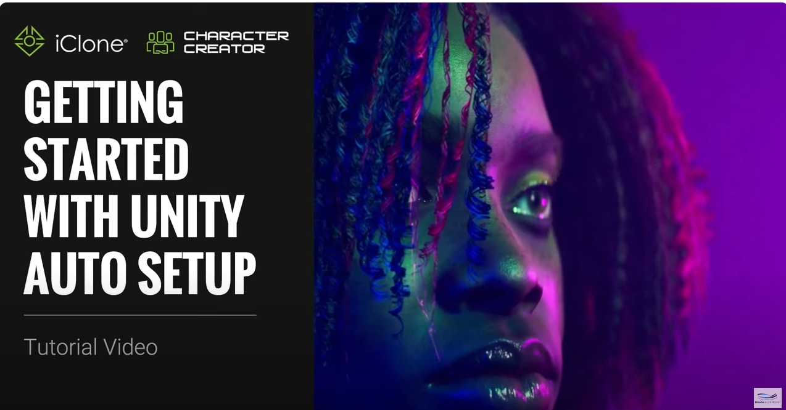
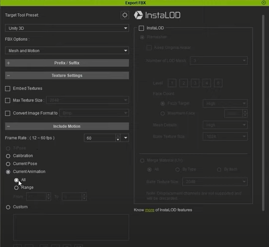
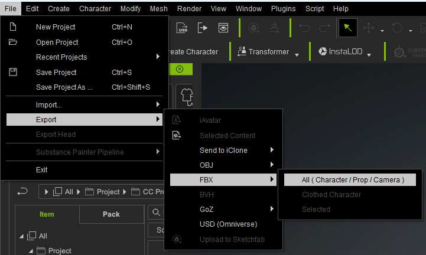
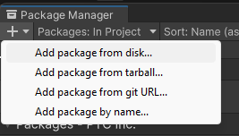
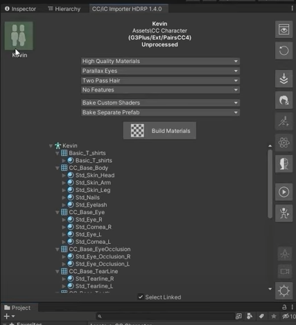
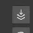
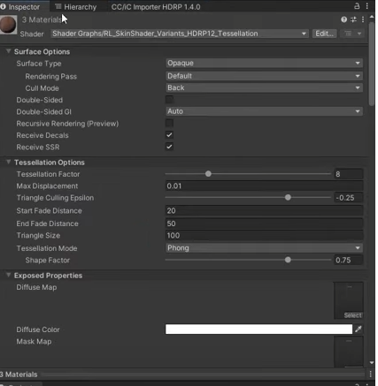

# Implementación de Character Creator en Unity

## Fonte

## Pasos

1. En primeiro lugar, hai que exportar en Character Creator (en adiante, CC) os personaxes que queremos levar a Unity. Para isto temos que seguir a seguinte ruta:

  Hai que asegurarse de elixir Unity 3D como o valor preestablecido no destino da descarga en "Target Tool Preset".

    - Para exportar o personaxe e o texto: File > Export > FBX > Mesh
    - Para exportar a animación: File > Export > FBX > Motion
    - Para exportar todo: File > Export > FBX > Mesh and Motion

   

   

 

2. Xa cos arquivos no noso ordenador pasamos a Unity, onde teremos que meter na carpeta de Assets todo o que descargamos do CC, para logo arrastrar e soltalos no programa.

3. Para traballar mellor co CC en Unity ca maior calidade posible, debemos descargar dende git o .zip dunha ferramenta chamada **CC Unity Tools** https://github.com/soupday/cc_unity_tools_3D

Gardámola no noso ordenador e extraemos todo.

4. Unha vez descargado este paquete dende o git, entramos a Window > Package Manager e dende o "+" clickamos en "add from disk". Agora o que temos que facer é buscar a carpeta CC Unity Tools que descargamos no paso anterior e seleccionar o package.json. Pinchamos nel e xa se importa ao Unity.

5. Unha vez feito isto, no menú superior aparecerache a opción **Real Ilusion** entre Services e Window. Clica nesta opción e seguido en Import Characters, verás que os personaxes que se importaron dende CC e gardamos na carpeta de Assets aparece na ventana que se nos abre de Real Ilusion.

    Hai unha serie de parámetros importantes, como nos mostra a captura, que hai que ter en conta para modificar neste punto dentro dos menús desplegables da parte superior. Se tocamos algún deste axuste, temos que clicar en **Build Materials** para gardar esta configuración.

7. Unha vez feito os axustes pertinentes ilumínase o botón de personaxe (no caso da captura, o de Kevin) o que indica que as configuracións se realizan correctamente. Agora dámoslle ao terceiro botón da columna en vertical da dereita: 

    Isto o que fai é crearnos un Prefab differente, que fai que lle poidas arrastrar as animacións ao Inspector. É importante o Inspector porque dende el pódeslle realizar axustes ao personaxes máis facilmente.

