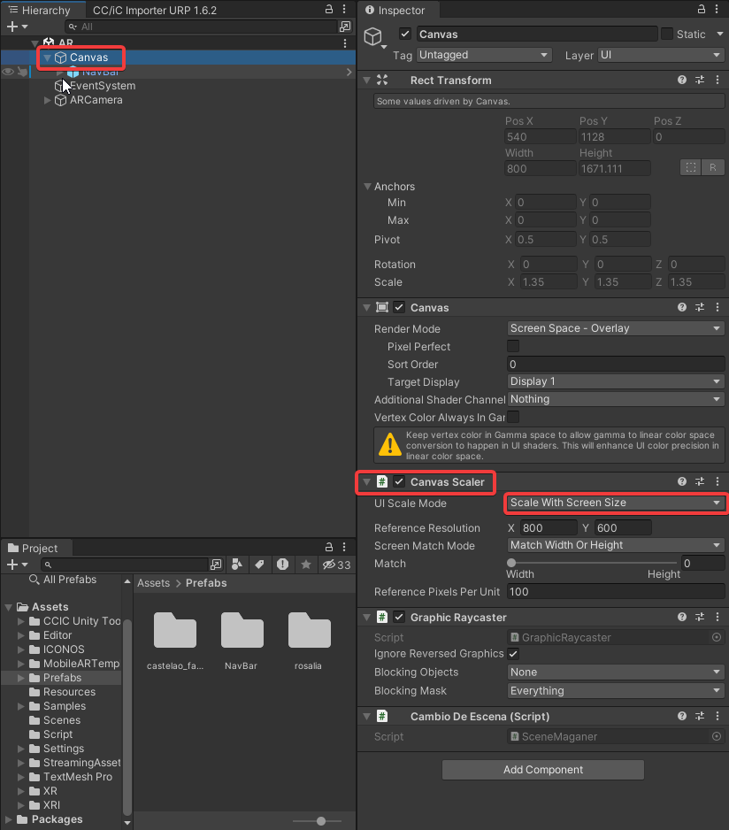
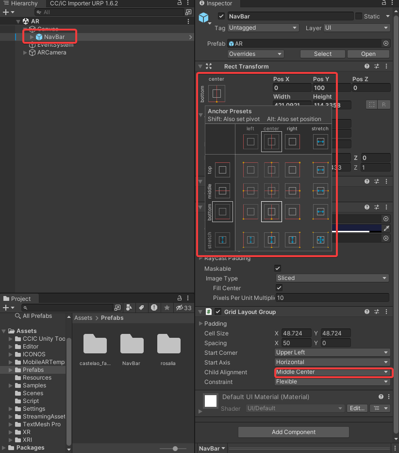

# Ajustes autoescalado.

1. Para autoajustar la resolución hay que activar las opciones marcadas en las capturas. Por defecto, en el canvas scaler está seleccionado la opción **Constant Pixel Size**, cambiarla a **Scale With Screen Size**.

    

2. También hay que tener en cuenta que el contenido metido en el **Canvas**, para que se quede fijo y se autoajuste, hay que seleccionar los **puntos de anclaje**.
    
    