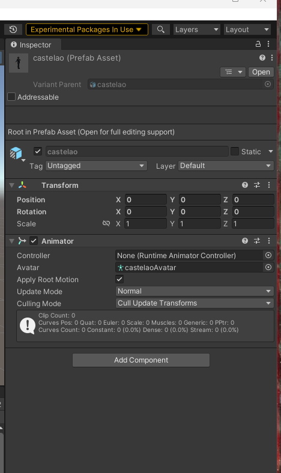
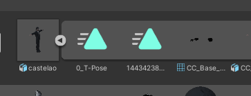
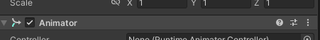
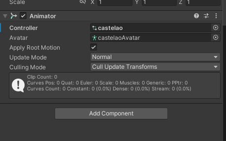
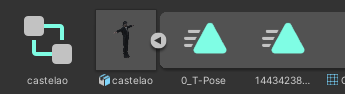

# Controlador en Unity para os movementos

1. Cargamos o personaxe en Unity.

2. Facémoslle o Build Materials dende RealIlusion e realizamos os cambios oportunos. Esto é fundamental que se faga o primeiro de todo, xa que se o fas despois sácache o controler.

3. Feito isto vemos que aínda non nos aparece o controlador. Isto é porque a animación hai que cargarlla aparte ao personaxe.
O Inspector debería de vérsenos así, co controller vacío:

4. Parte importante: para que se nos vexa o controlador temos que arrastrar o movemento que queiramos implementar ao personaxe na **barra de Animator** dentro do Inspector NON dentro de controler, avatar ou outra opción dentro do Animator.

5. Unha vez arrastrado o movemento que desexamos poñerlle ao noso personaxe, apareceranos no controller o nome de dito movemento, e un cadrado (símbolo do controller) na carpeta do personaxe. Tal que así:
Cando o controllador e o avatar están incluídos o movemento funciona. Se un dos dous campos está baleiro, non funciona.

