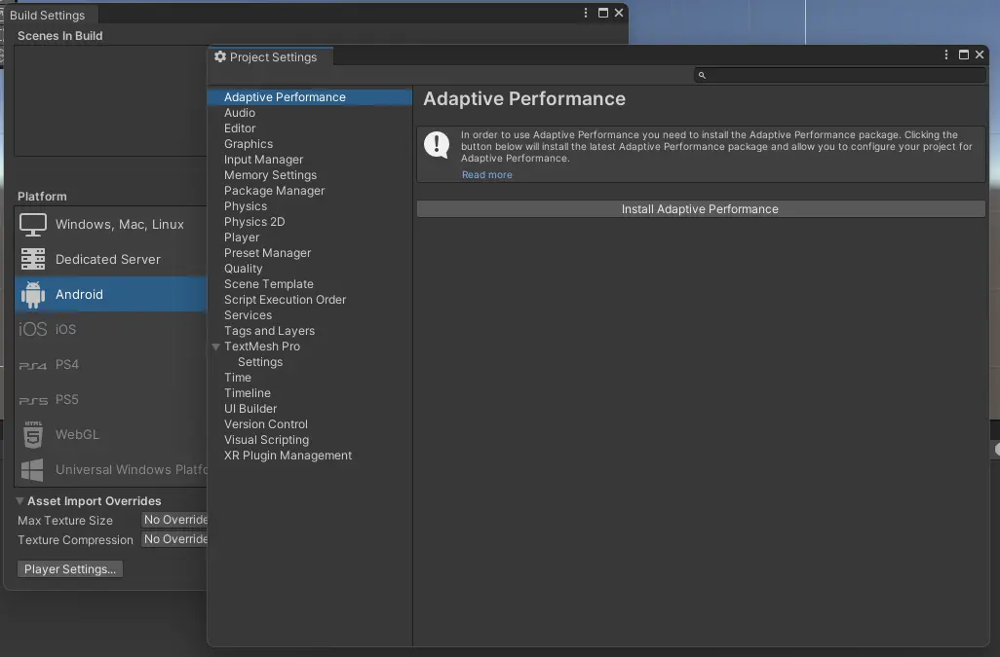

# Errores o avisos típicos

:warning: [Adaptive Performance] No Active Loader was found. Make sure to select your loader in the Adaptive Performance Settings for this platform.

<code>File/Build Settings</code>

**NOS MOVEMOS POR ARENAS MOVEDIZAS**. Este problema puede venir de ciertos dispositivos. A no ser que sepas lo que haces recomendamos la solución de abajo.

## Solución

A veces cerrando y abriendo **Unity** desaparece este aviso.

#Error packages Vuforia app PraceAR

⚠️ An error occurred while resolving packages:
  Project has invalid dependencies:
    com.soupday.cc3_unity_tools: The file [C:\Users\PC_OBRADOIROS_01\Desktop\Curso unity\cc_unity_tools_3D-1.6.2\cc_unity_tools_3D-1.6.2\package.json] cannot be found

## Solución

En la carpeta de packages mover el archivo que corresponde según lo que indica el propio error.
