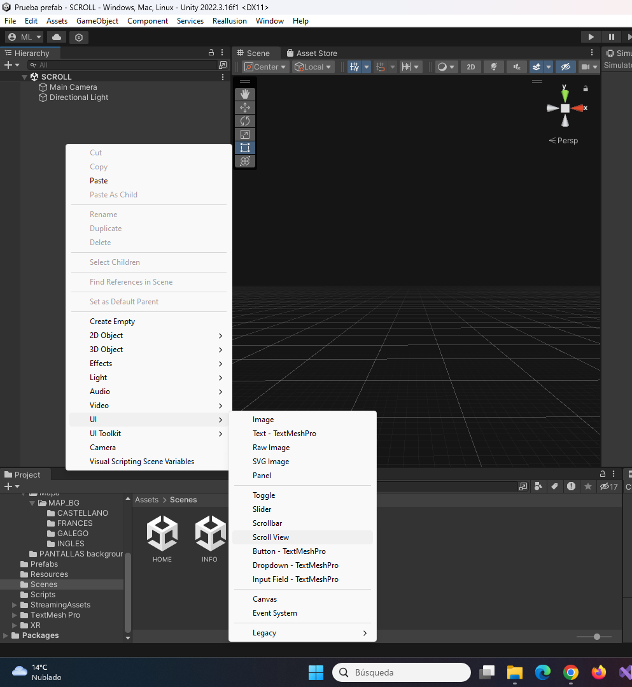
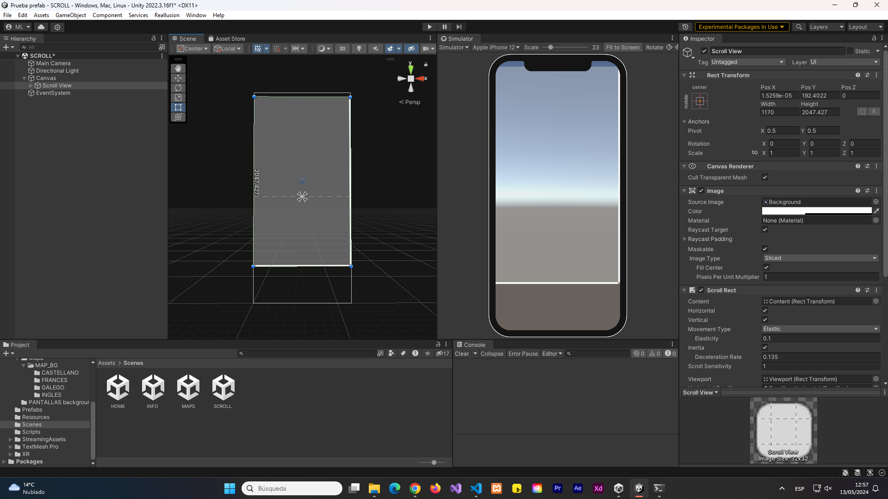
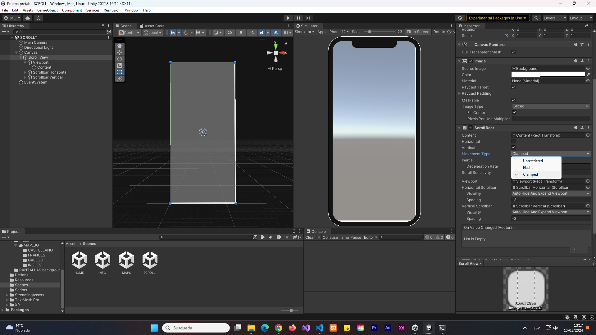
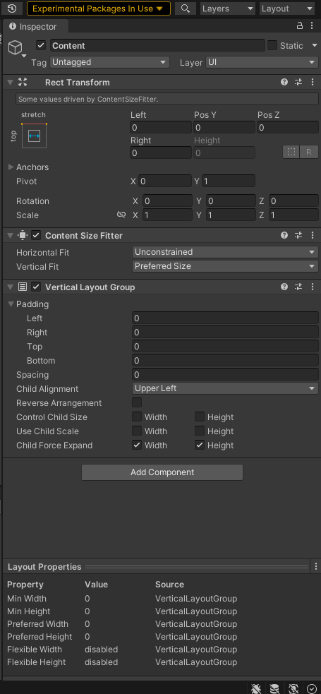
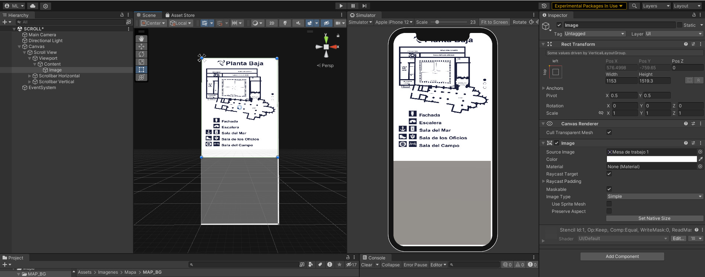

# Scroll View Vertical en Unity

- ⏯️[Video configuración Scroll](https://www.youtube.com/watch?v=nXr-54JnG40)

- Creamos UI > Scroll View
    

- Ajustamos el tamaño del Scroll View a la pantalla del Canvas
    

- En Scroll View, desmarcamos el check Horizontal y en Movement Type seleccionamos Clamped 
    

- Sobre el Content, añadimos los siguientes componentes (Content Size Fitter y Vertical Layout Group ). Ajustaremos el padding y el espaciado según nuestras necesidades
    

- Dentro del Content, añadiremos una Imagen. Ajustamos el tamaño y arrastramos la imagen correspondiente.
    

- Posteriormente podemos duplicar esta imagen las veces que sea necesario según los elementos de nuestro Scroll