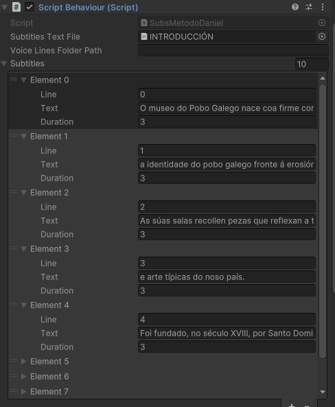

# Implementación dos subtítulos en Unity

## Fonte

[](https://www.youtube.com/watch?v=7KQt7_eWGzY)

## Pasos

1. Empregaremos este script: 

```
using System;
using System.Collections;
using UnityEngine;
using System.Linq;
using TMPro;

public class ScriptBehaviour : MonoBehaviour
{
    [SerializeField] private TextAsset SubtitlesTextFile;
    [SerializeField] private string voiceLinesFolderPath;
    [SerializeField] private Subtitle[] subtitles;

    [SerializeField] private int currentSubtitleIndex;

    private void OnValidate()
    {
        string[] subtitleLines = SubtitlesTextFile.text.Split(new[] { Environment.NewLine }, StringSplitOptions.RemoveEmptyEntries);

        subtitles = new Subtitle[subtitleLines.Length];

        for (int i = 0; i < subtitleLines.Length; i++)
        {
            string[] parts = subtitleLines[i].Split(';');

            string text = parts[0].Trim();
            float duration = float.Parse(parts[1].Trim());

            subtitles[i] = new Subtitle
            {
                line = i,
                text = text,
                duration = duration
            };
        }
    }

    private IEnumerator ShowSubtitles()
    {
        while (currentSubtitleIndex < subtitles.Length)
        {
            GetComponent<TextMeshProUGUI>().text = subtitles[currentSubtitleIndex].text;
            yield return new WaitForSeconds(subtitles[currentSubtitleIndex].duration);
            currentSubtitleIndex++;
        }
    }

    // Start is called before the first frame update
    private void Start() => StartCoroutine(ShowSubtitles());
}

[Serializable]
public class Subtitle
{
    public int line;
    public string text;
    public float duration;
}


```

2. Dentro do canvas crearemos un TMP, onde lle daremos os axustes que queiramos (tamaño, xustificado, tipografía...). Arrastraremos o script anterior ao **Add Component** do Inspector do texto, e abrirásenos un **Script Behaviour**. 


3. Este componente permítenos meter o texto que queremos proxectar en formato .txt só arrestrándoo a **Subtitules Text File**. Podemos crear unha carpeta de textos dentro dos Assets para ser máis ordenados. Aquí é importante poñer nun formato correcto os textos dentro do .txt para que sexa máis fácil que Unity os asimile. Separaremos as liñas na orde que queiramos que aparezan no xogo. Ó final de cada liña poñerémoslle un punto e coma, espacio, e os segundos que queiramos que apareza en pantalla.


 Os audios de cada personaxe duran un máximo de 29 segundos, polo tanto os textos como máximo durarán 28. O números despois do punto e coma do .txt é a duranción de cada liña en pantalla, cada unha delas pode levar unha duración diferente pero a suma de todas elas ten que dar como máximo 28 segundos.

4. Unha vez feito isto, ao arrastrar o .txt a **Subtitules Text File**, dentro do desplegable **Subtitles** aparecerán tantos elementos como liñas haxa no .txt.



